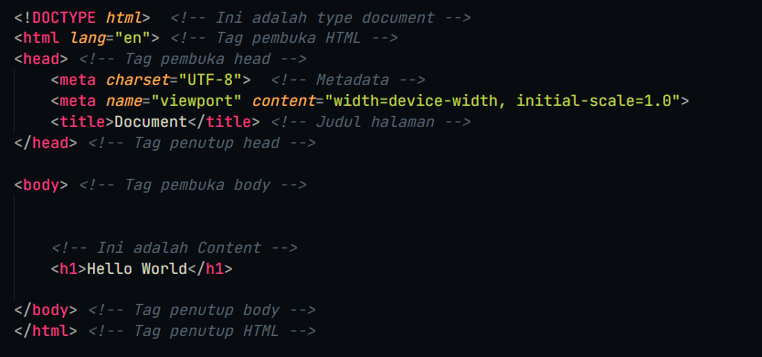
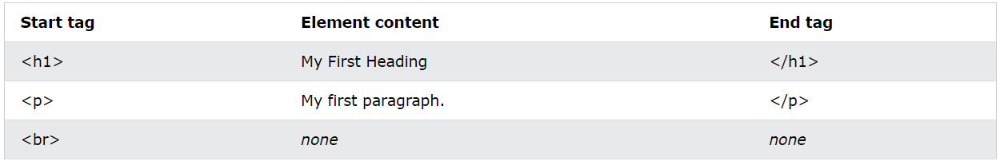
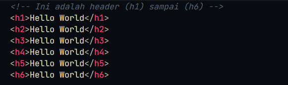

# HTML Dasar
HTML adalah Hypertext Markup Language atau sering di sebut bahasa markup. HTML biasanya digunakan dalam pengembangan sebuah website dan merupkan pondasi awal dalam menentukan struktur atau tulang dari halaman web.

## Struktur Dasar HTML 
Struktur utama dari HTML terdiri dari tag `<head>` dan tag `body`. di dalam tag `<head>` biasanya berisi informasi penting seperti contohnya metadata, judul halaman dan source. Sedangkan tag `<body>` berisi informasi atau konten yang akan di tampilkan ke halaman website, contohnya header, paragraf, gambar, icon, input, dll. 

## Element HTML
Element biasanya di tentukan dengan adanya tag pembukan (awal), isi content, tag penutup (akhir). silahkan perhatikan gambar di bawah

## Tag dan Element HTML
Inilah beberapa tag dan element HTML yang sering digunakan beserta fungsinya

### Heading
Befungsi untuk membuat judul sebuah konten  

### Paragraph
Berfungsi untuk membuat paragraf  

